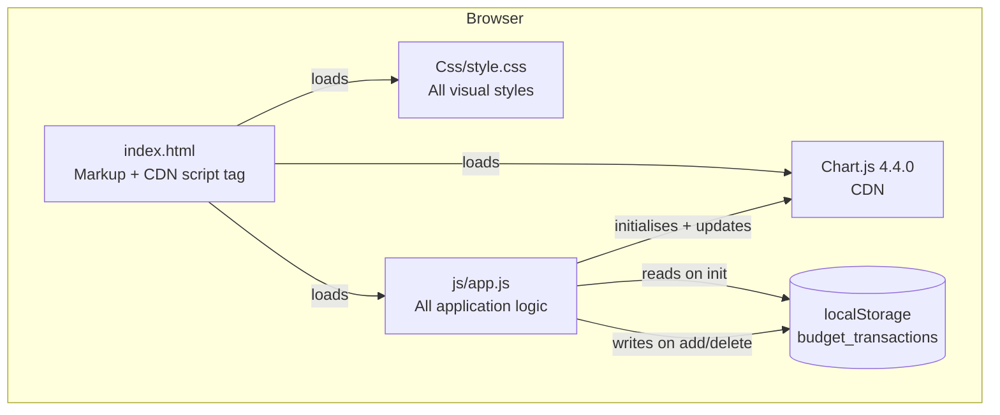
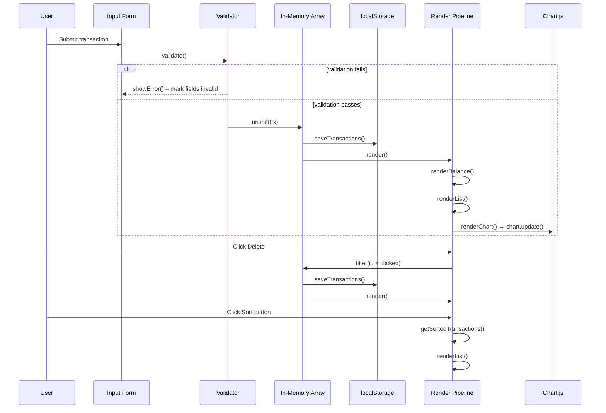
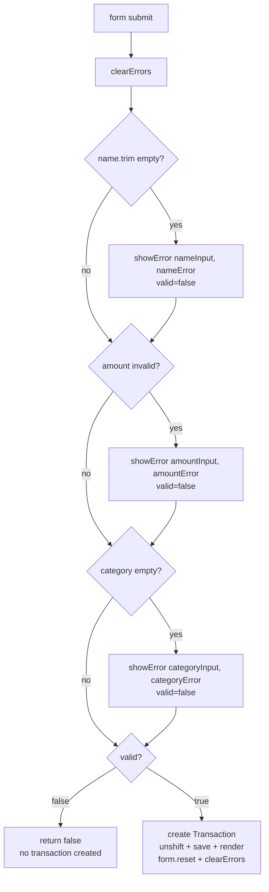
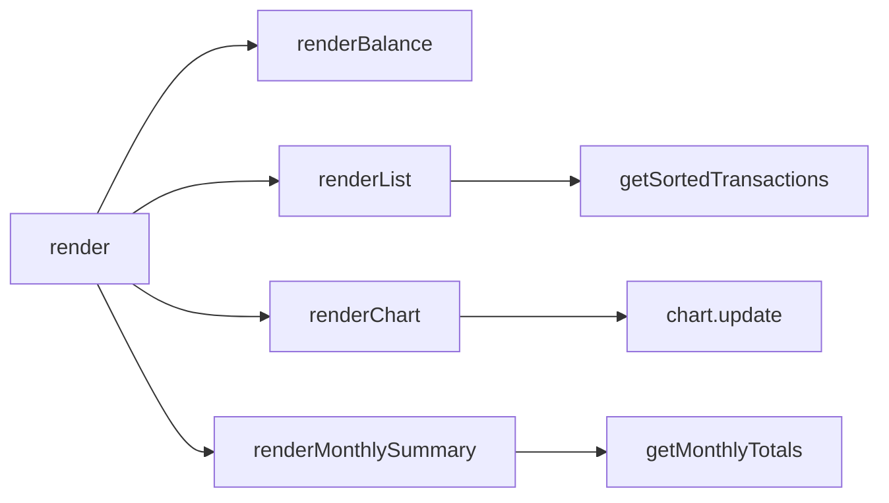

# Design Document: Expense & Budget Visualizer

## Overview

The Expense & Budget Visualizer is a fully client-side, single-page web application that lets users record spending transactions, view a running total balance, browse a sortable transaction history, and see a doughnut chart breakdown of spending by category. The implementation is intentionally minimal: one HTML file, one CSS file, one JavaScript file, and the Chart.js 4.4.0 library loaded from CDN — no framework, no build step, no server.

All state lives in a JavaScript array in memory and is mirrored to `localStorage` on every mutation. On page load, the persisted array is restored and the entire UI is re-rendered from scratch. This "re-render everything" model keeps the data flow simple and easy to reason about.

---

## Architecture



### Module Responsibilities

| Module | Responsibility |
|---|---|
| `index.html` | Declares DOM structure, loads CSS and scripts |
| `Css/style.css` | All presentational rules — layout, colours, animations, responsive breakpoints |
| `js/app.js` | State management, form handling, validation, DOM rendering, chart control, localStorage I/O |
| Chart.js (CDN) | Renders and animates the doughnut chart; owned by `app.js` after `initChart()` |

### Data Flow



---

## Components and Interfaces

### Component 1: Header / Balance Display

**Purpose**: Shows the app title and the current total of all transaction amounts as a formatted Rupiah string.

**DOM element**: `<header class="app-header">` → `<p id="totalBalance">`

**Responsibilities**:
- Display `Rp 0` when no transactions exist.
- Re-render on every add and delete event.
- Visual styling: full-width gradient header, glassmorphism balance card.

**Interface** (rendered by `renderBalance()`):
```
renderBalance()
  reads:   transactions[]
  writes:  totalBalance.textContent ← formatRp(sum of amounts)
  effects: none
```

---

### Component 2: Input Form

**Purpose**: Collects the three fields required to create a transaction and delegates to the Validator before committing.

**DOM element**: `<form id="transactionForm">`

**Fields**:

| Field | DOM ID | Type | Constraint |
|---|---|---|---|
| Item Name | `itemName` | `<input type="text">` | ≥ 1 non-whitespace character |
| Amount | `itemAmount` | `<input type="number" min="1">` | finite number > 0 |
| Category | `itemCategory` | `<select>` | one of `Food`, `Transport`, `Fun` |

**Interface** (submit handler in `app.js`):
```
onSubmit(event)
  preventDefault()
  if not validate() → return
  build tx = { id: Date.now(), name: trim(nameInput.value),
               amount: parseFloat(amountInput.value),
               category: categoryInput.value }
  transactions.unshift(tx)
  saveTransactions()
  render()
  form.reset()
  clearErrors()
```

---

### Component 3: Chart Card

**Purpose**: Renders a Chart.js doughnut chart segmented by category spending totals.

**DOM elements**: `<section class="card chart-card">` → `<canvas id="spendingChart">` + `<p id="chartEmpty">`

**Responsibilities**:
- Show the canvas and hide the empty-state message when ≥ 1 transaction exists.
- Show the empty-state message and zero-out chart data when all transactions are deleted.
- Synchronously update on every add/delete event.

**Interface**:
```
initChart()       — called once on page load, creates the Chart.js instance
renderChart()     — called by render(), computes per-category totals,
                    updates chart.data.labels / .data / .backgroundColor, calls chart.update()
```

---

### Component 4: Transaction List Card

**Purpose**: Displays all transactions in a scrollable list, supports deletion, and reorders the list according to the active sort mode.

**DOM elements**: `<section class="card list-card">` → `<div id="transactionList">` + `<p id="listEmpty">`

**Transaction item HTML structure** (per `renderList()`):
```html
<div class="transaction-item" data-id="[tx.id]">
  <div class="tx-info">
    <div class="tx-name">[escapeHtml(tx.name)]</div>
    <div class="tx-category">
      <span class="badge [tx.category]">[tx.category]</span>
    </div>
  </div>
  <span class="tx-amount">[formatRp(tx.amount)]</span>
  <button class="btn-delete" aria-label="Delete transaction" data-id="[tx.id]">Delete</button>
</div>
```

**Responsibilities**:
- Remove previous items (`querySelectorAll('.transaction-item')`) before each re-render.
- Apply `getSortedTransactions()` to determine rendering order.
- Use event delegation on `listEl` for delete clicks.

---

### Component 5: Sort Controls

**Purpose**: Three pill buttons that change `currentSort` and trigger a re-render of the Transaction List.

**DOM elements**: `<div class="sort-controls">` → `<button class="sort-btn">` × 3

**Sort modes**:

| Button label | `data-sort` value | Sort logic |
|---|---|---|
| Newest | `newest` | Preserves array insertion order (`unshift` → index 0 = newest) |
| Amount | `amount` | `b.amount - a.amount` (descending) |
| Category | `category` | `a.category.localeCompare(b.category)`, then `a.name.localeCompare(b.name)` |

**Interface**:
```
getSortedTransactions() → Transaction[]
  reads:   transactions[], currentSort
  returns: shallow copy sorted per currentSort
  effects: none (pure, no mutation of source array)
```

---

### Component 6: Monthly Summary Card

**Purpose**: Aggregates all transactions by calendar month and renders a reverse-chronological list of per-month spending totals.

**DOM elements**: `<section class="card summary-card">` → `<div id="monthlySummaryList">` + `<p id="summaryEmpty">`

**Month key format**: `YYYY-MM` string derived from `new Date(tx.id)` — e.g. `2025-01` for January 2025.

**Month label format**: Full month name + four-digit year in `en-US` locale — e.g. `January 2025` — produced by:
```javascript
new Date(year, monthIndex).toLocaleString('en-US', { month: 'long', year: 'numeric' })
```

#### `getMonthlyTotals()`

**Signature**: `getMonthlyTotals(): Array<{ key: string, label: string, total: number }>`

**Algorithm**:
```
map = {}
for each tx in transactions:
    d    = new Date(tx.id)
    key  = d.getFullYear() + '-' + String(d.getMonth()+1).padStart(2,'0')
    if key not in map:
        map[key] = { key, label: formatMonthLabel(d), total: 0 }
    map[key].total += tx.amount

return Object.values(map)
           .sort((a, b) => b.key.localeCompare(a.key))   // reverse-chronological
```

Only months that contain at least one transaction appear in the result — months whose last transaction has been deleted are automatically absent because they never enter `map`.

#### `renderMonthlySummary()`

```
renderMonthlySummary()
  reads:   transactions[]
  writes:  monthlySummaryList DOM
  effects: shows/hides summaryEmpty

1. Remove all existing .summary-month-row elements from monthlySummaryList.
2. months = getMonthlyTotals()
3. If months.length === 0: show summaryEmpty, return.
4. Hide summaryEmpty.
5. For each { label, total } in months:
     create a div.summary-month-row containing:
       <span class="summary-month-label">[label]</span>
       <span class="summary-month-total">[formatRp(total)]</span>
     append to monthlySummaryList.
```

**Empty-state handling**: `summaryEmpty` is displayed (and no rows are appended) whenever `transactions.length === 0` or `getMonthlyTotals()` returns an empty array.

---

### Component 7: Theme Toggle

**Purpose**: A button in the page header that switches the active colour scheme between `light` and `dark`, persists the choice, and updates its own label to reflect the current theme.

**DOM element**: `<button id="themeToggle" class="theme-toggle-btn">` inside `<header class="app-header">`

**Functions**:

#### `applyTheme(theme)`

```
applyTheme(theme: 'light' | 'dark'): void
  if theme === 'dark':
      document.body.classList.add('dark-mode')
  else:
      document.body.classList.remove('dark-mode')
  themeToggleBtn.textContent = theme === 'dark' ? '☀️ Light Mode' : '🌙 Dark Mode'
  currentTheme = theme
```

No `element.style.*` colour assignments are made — all visual changes flow through the `.dark-mode` class and CSS custom properties defined in `Css/style.css`.

#### `toggleTheme()`

```
toggleTheme(): void
  newTheme = currentTheme === 'dark' ? 'light' : 'dark'
  applyTheme(newTheme)
  localStorage.setItem('theme', newTheme)
```

#### Init (inside `DOMContentLoaded`):

```
stored = localStorage.getItem('theme')
theme  = (stored === 'dark' || stored === 'light') ? stored : 'light'
applyTheme(theme)
themeToggleBtn.addEventListener('click', toggleTheme)
```

#### CSS variable approach

`.dark-mode` on `<body>` redefines the following custom properties (declared with defaults on `:root`):

| Custom Property | Light value | Dark value |
|---|---|---|
| `--color-bg` | `#f0f4ff` | `#0f1117` |
| `--color-surface` | `#ffffff` | `#1c1f2e` |
| `--color-text` | `#1e293b` | `#e2e8f0` |
| `--color-border` | `rgba(0,0,0,0.08)` | `rgba(255,255,255,0.10)` |
| `--color-header-start` | `#1d6ff2` | `#0d1b3e` |
| `--color-header-end` | `#0ea5e9` | `#0d3060` |

All card backgrounds, text colours, borders, and the header gradient reference these properties — no additional JavaScript style overrides are required.

---

## Data Models

### Transaction Object

```
Transaction {
  id:       number   — Date.now() at creation time; unique positive integer
  name:     string   — trimmed, non-empty, user-supplied item label
  amount:   number   — positive finite float (stored as-is, displayed truncated by Formatter)
  category: string   — one of "Food" | "Transport" | "Fun"
}
```

**Validation Rules**:
- `id`: assigned by runtime, never user-supplied; treated as opaque identifier.
- `name`: must be non-empty after `.trim()`; max length not enforced by code but limited by `<input>` UI.
- `amount`: `parseFloat` result; must satisfy `!isNaN(amt) && amt > 0`.
- `category`: must match one of the three allowed string literals exactly.

---

### In-Memory State

```
transactions: Transaction[]   — mutable array; index 0 = most recently added
currentSort:  'newest' | 'amount' | 'category'   — default 'newest'
chart:        Chart | null    — Chart.js instance; null before initChart() runs
currentTheme: 'light' | 'dark'   — default 'light'; updated by applyTheme()
```

---

### localStorage Schema

```
Key:   'budget_transactions'
Value: JSON.stringify(Transaction[])
       e.g. '[{"id":1718000000000,"name":"Coffee","amount":25000,"category":"Food"}]'

Key:   'theme'
Value: 'light' | 'dark'
       e.g. 'dark'
       Absent or any other string → treated as 'light' during init.
```

**Failure modes handled**:
- `getItem('budget_transactions')` returns `null` → treated as empty array.
- `JSON.parse` throws → caught, returns `[]`.
- `setItem` throws (quota exceeded) → transaction retained in memory, visible error shown to user.
- `getItem('theme')` returns `null` or invalid string → defaults to `'light'`.

---

## Utility Functions

### `formatRp(amount)`

Converts a numeric amount to an Indonesian Rupiah display string.

**Signature**: `formatRp(amount: number): string`

**Algorithm**:
```
if amount is negative or non-finite:
    return 'Rp 0'
floored ← Math.floor(amount)
return 'Rp ' + floored.toLocaleString('id-ID')
```

**Examples**:

| Input | Output |
|---|---|
| `0` | `'Rp 0'` |
| `20000` | `'Rp 20.000'` |
| `1500000` | `'Rp 1.500.000'` |
| `20000.99` | `'Rp 20.000'` |
| `-100` | `'Rp 0'` |

---

### `escapeHtml(str)`

Prevents XSS by converting the five dangerous HTML characters to their entity equivalents before inserting user-supplied text into `innerHTML`.

**Signature**: `escapeHtml(str: string): string`

**Replacement table**:

| Character | Entity |
|---|---|
| `&` | `&amp;` |
| `<` | `&lt;` |
| `>` | `&gt;` |
| `"` | `&quot;` |
| `'` | `&#039;` |

**Properties**:
- Idempotent on inputs that contain only safe characters.
- Applied in order (& first) to prevent double-escaping.
- Empty string input → empty string output.

---

### `loadTransactions()`

**Signature**: `loadTransactions(): Transaction[]`

Reads from `localStorage.getItem('budget_transactions')`, parses JSON, returns array. Returns `[]` on any failure.

---

### `saveTransactions()`

**Signature**: `saveTransactions(): void`

Calls `localStorage.setItem('budget_transactions', JSON.stringify(transactions))`. Any `QuotaExceededError` must be caught and surfaced to the user (see Requirement 5.5).

---

## Validation Logic



**`showError(input, msgEl)`**:
- Adds `invalid` class to the `<input>` or `<select>` element.
- Adds `visible` class to the sibling `<span class="error-msg">`.

**`clearErrors()`**:
- Removes `invalid` from all three input elements.
- Removes `visible` from all three error message elements.

---

## Rendering Pipeline



`render()` is the single entry point called after every state mutation (add, delete, init). It calls all four sub-renderers unconditionally.

**`renderBalance()`**:
- Sums `tx.amount` for all transactions using `Array.reduce`.
- Writes `formatRp(total)` into `totalBalance.textContent`.

**`renderList()`**:
1. Remove all existing `.transaction-item` elements from `listEl`.
2. If `transactions.length === 0`, show `listEmpty`, return.
3. Otherwise, hide `listEmpty`, iterate `getSortedTransactions()`, create and append a `div.transaction-item` per transaction using `innerHTML` with `escapeHtml` and `formatRp`.

**`renderChart()`**:
1. Compute per-category totals: `{ Food: 0, Transport: 0, Fun: 0 }`.
2. Filter to `activeCategories` where total > 0.
3. If none, zero out chart arrays, call `chart.update()`, show `chartEmpty`, return.
4. Otherwise, set `chart.data.labels`, `.data`, `.backgroundColor` to the active entries, call `chart.update()`, hide `chartEmpty`.

---

## Chart Integration

### Initialisation (`initChart()`)

Called once on page load before `render()`. Creates a Chart.js `'doughnut'` instance on `#spendingChart`:

```javascript
{
  type: 'doughnut',
  data: { labels: [], datasets: [{ data: [], backgroundColor: [], borderWidth: 0, hoverOffset: 8 }] },
  options: {
    responsive: true,
    maintainAspectRatio: true,
    cutout: '60%',
    plugins: {
      legend: { position: 'bottom', labels: { padding: 16, usePointStyle: true, pointStyleWidth: 10 } },
      tooltip: { callbacks: { label: (ctx) => ` ${formatRp(ctx.parsed)}` } }
    }
  }
}
```

### Category Colour Map (`CATEGORY_CONFIG`)

```javascript
const CATEGORY_CONFIG = {
  Food:      { color: '#f49a13ff' },   // amber/orange
  Transport: { color: '#1d6ff2'   },   // blue
  Fun:       { color: '#0bfe13ff' },   // green
};
```

### Dynamic Update

On every `renderChart()` call, only categories with totals > 0 are placed into the three parallel arrays (`labels`, `data`, `backgroundColor`). This ensures zero-total categories never appear as empty segments.

### Empty-State Handling

When `activeCategories.length === 0`:
- `chart.data.labels = []` and `chart.data.datasets[0].data = []`
- `chart.update()` clears the canvas.
- `chartEmpty` paragraph is shown.

### Tooltip Formatting

The custom `label` callback passes `ctx.parsed` (the raw numeric segment value) through `formatRp`, producing a tooltip like ` Rp 20.000`.

---

## Persistence

```mermaid
sequenceDiagram
    participant App as app.js
    participant LS as localStorage

    Note over App: Page load
    App->>LS: getItem('budget_transactions')
    alt key exists and valid JSON array
        LS-->>App: JSON string
        App->>App: JSON.parse → transactions[]
    else null, malformed JSON, or non-array
        LS-->>App: null / throws
        App->>App: transactions = []
    end
    App->>App: initChart(); render()

    Note over App: Add / Delete
    App->>App: mutate transactions[]
    App->>LS: setItem('budget_transactions', JSON.stringify(transactions))
    alt setItem succeeds
        LS-->>App: ok
    else QuotaExceededError
        LS-->>App: throws
        App->>App: retain transaction in memory
        App->>App: display visible save-error indication
    end
```

**Key**: `'budget_transactions'`  
**Format**: JSON array of `Transaction` objects  
**Read**: `loadTransactions()` called before `initChart()` and `render()`  
**Write**: `saveTransactions()` called after every `unshift` (add) and `filter` (delete)

---

## Security

### HTML Sanitisation

All user-supplied text (the `name` field) is passed through `escapeHtml()` before being placed in `innerHTML`:

```javascript
item.innerHTML = `
  <div class="tx-name">${escapeHtml(tx.name)}</div>
  ...
`;
```

This prevents stored XSS: even if a user enters `<script>alert(1)</script>`, the rendered text in the DOM will be the literal escaped characters, never executed as markup or script.

### No Raw innerHTML of User Data

- `tx.amount` is a number (not user-entered text) → no escaping needed.
- `tx.category` is constrained to one of three known string literals by the `<select>` element and validation → no escaping needed.
- `tx.id` is `Date.now()` → numeric, never injected.

### No External Requests

The app makes zero XHR, Fetch, or WebSocket calls. All data stays in the browser.

---

## Responsive and Visual Design

### Layout

```
max-width: 480px
margin: 0 auto
padding: 0 16px (mobile) / 0 24px (≥ 520px)
flex-direction: column
gap: 18px
```

All cards (`.app-main > .card`) stack in a single column at all viewport widths because `flex-direction: column` is always active — there is no breakpoint switching to a multi-column grid.

### Balance Card Glassmorphism

```css
background: rgba(255, 255, 255, 0.18);
backdrop-filter: blur(6px);
border: 1px solid rgba(255, 255, 255, 0.3);
border-radius: 16px;   /* ≥ 12px requirement */
```

Renders as a frosted-glass card layered over the blue gradient header.

### Scrollable Transaction List

```css
.list-wrapper {
  max-height: 320px;
  overflow-y: auto;
}
```

Items beyond 320px scroll internally; the page itself never scrolls to reveal overflow list content.

### Category Badge Colours

| Category | Background | Text |
|---|---|---|
| Food | `rgba(244,160,36,0.15)` | `#b45309` (amber) |
| Transport | `rgba(29,111,242,0.12)` | `#1558c9` (blue) |
| Fun | `rgba(9,102,3,0.12)` | `rgb(9,229,2)` (green) |

### Animations

Transaction items slide in on insertion via a CSS `@keyframes slideIn` animation (opacity 0→1, translateY −8px→0, 0.25s ease).

---

## Error Handling

### Scenario 1: Form Validation Failure

**Condition**: User submits with one or more empty/invalid fields.  
**Response**: `showError()` marks the offending fields; no transaction is created, no save occurs.  
**Recovery**: `clearErrors()` resets on the next submit attempt (called at the top of `validate()`).

### Scenario 2: localStorage Parse Failure

**Condition**: Stored value is `null`, not valid JSON, or not an array.  
**Response**: `loadTransactions()` catch block silently returns `[]`.  
**Recovery**: App starts fresh; previously persisted data is effectively lost (corrupted key).

### Scenario 3: localStorage Quota Exceeded

**Condition**: `setItem` throws `QuotaExceededError` or similar.  
**Response**: Transaction remains in memory (the user still sees it this session) but is not persisted. A visible save-error indication is shown to the user (Requirement 5.5).  
**Recovery**: User must free browser storage to enable persistence again.

---

## Testing Strategy

### Unit Testing Approach

Test each pure utility function in isolation:

- `formatRp`: boundary values (0, 1, large integers, floats, negatives, `Infinity`, `NaN`).
- `escapeHtml`: each of the five special characters, combinations, empty string, string with no special characters.
- `getSortedTransactions`: each of the three sort modes with multiple transactions, ties in amount, ties in category.
- `loadTransactions`: mock `localStorage` returning `null`, valid JSON, malformed JSON, valid JSON that is not an array.

### Property-Based Testing Approach

**Property Test Library**: `fast-check`

#### Property 1 — `formatRp` always returns a valid Rp string

For any finite non-negative number `n`:
```
∀ n ∈ [0, 999_999_999_999]:
  formatRp(n).startsWith('Rp ')
  ∧ formatRp(n) contains no decimal separator
  ∧ Math.floor(n) represented correctly with id-ID thousands separators
```

#### Property 2 — `formatRp` floors (no decimal part)

```
∀ n ≥ 0:
  formatRp(n) === formatRp(Math.floor(n))
```

#### Property 3 — `formatRp` safe fallback for non-positive inputs

```
∀ n < 0 ∨ n ∈ { -Infinity, +Infinity, NaN }:
  formatRp(n) === 'Rp 0'
```

#### Property 4 — `escapeHtml` output contains no raw dangerous characters

```
∀ str: string:
  let out = escapeHtml(str)
  out does not contain '&' (except as start of &...; entity)
  ∧ out does not contain '<'
  ∧ out does not contain '>'
  ∧ out does not contain '"'
  ∧ out does not contain "'"
```

#### Property 5 — `escapeHtml` is idempotent on already-safe strings

```
∀ str containing only characters outside { &, <, >, ", ' }:
  escapeHtml(str) === str
```

#### Property 6 — `escapeHtml` empty-string identity

```
escapeHtml('') === ''
```

#### Property 7 — Sort order: `amount` descending

```
∀ transactions[]: length ≥ 2, currentSort = 'amount':
  let sorted = getSortedTransactions()
  ∀ i ∈ [0, sorted.length−2]:
    sorted[i].amount ≥ sorted[i+1].amount
```

#### Property 8 — Sort order: `category` alphabetical then name alphabetical

```
∀ transactions[]: length ≥ 2, currentSort = 'category':
  let sorted = getSortedTransactions()
  ∀ i ∈ [0, sorted.length−2]:
    sorted[i].category ≤ sorted[i+1].category
    ∧ (sorted[i].category === sorted[i+1].category
       → sorted[i].name ≤ sorted[i+1].name)
```

#### Property 9 — Sort preserves all transactions (no data loss)

```
∀ transactions[], ∀ sortMode:
  getSortedTransactions().length === transactions.length
  ∧ every tx in transactions appears exactly once in result
```

#### Property 10 — Balance equals sum of all amounts

```
∀ transactions[]:
  let total = transactions.reduce((s, tx) => s + tx.amount, 0)
  renderBalance() sets totalBalance.textContent === formatRp(total)
```

#### Property 11 — Chart labels are a subset of { Food, Transport, Fun }

```
∀ transactions[]:
  after renderChart():
    chart.data.labels ⊆ { 'Food', 'Transport', 'Fun' }
    ∧ chart.data.labels.length === chart.data.datasets[0].data.length
    ∧ chart.data.datasets[0].data.length === chart.data.datasets[0].backgroundColor.length
```

#### Property 12 — Chart omits zero-total categories

```
∀ transactions[]:
  ∀ category c ∈ { Food, Transport, Fun }:
    sum(transactions where category = c) = 0
    → c ∉ chart.data.labels
```

### Integration Testing Approach

End-to-end scenarios to exercise the full pipeline:

1. **Add → verify balance, list, chart all update** in a single render call.
2. **Delete last transaction → verify empty states** appear in list and chart simultaneously.
3. **Sort change → list reorders without affecting balance or chart**.
4. **Page reload with seeded localStorage → correct initial render** of all three components.
5. **Corrupted localStorage → app starts cleanly** with empty state.

---

## Correctness Properties

The following properties formally capture what the system must guarantee. They are the basis for the property-based tests described in the Testing Strategy section.

### Property 1: `formatRp` always returns a valid Rp string

**Validates: Requirements 6.1**

```
∀ n ∈ ℝ, n ≥ 0, n is finite:
  formatRp(n).startsWith('Rp ')
  ∧ formatRp(n) contains no '.' decimal separator after the integer part
```

### Property 2: `formatRp` truncates (floors) fractional amounts

**Validates: Requirements 6.1**

```
∀ n ≥ 0, n is finite:
  formatRp(n) === formatRp(Math.floor(n))
```

### Property 3: `formatRp` returns `'Rp 0'` for non-positive or non-finite inputs

**Validates: Requirements 6.1**

```
∀ n where n < 0 ∨ n ∈ {-Infinity, +Infinity, NaN}:
  formatRp(n) === 'Rp 0'
```

### Property 4: `escapeHtml` output contains no raw dangerous characters

**Validates: Requirements 6.2**

```
∀ str: string:
  let out = escapeHtml(str)
  ¬(out contains raw '&') ∧ ¬(out contains '<') ∧ ¬(out contains '>')
  ∧ ¬(out contains '"') ∧ ¬(out contains "'")
```

### Property 5: `escapeHtml` is identity on strings with no special characters

**Validates: Requirements 6.2**

```
∀ str: string where str ∩ {'&','<','>','"',"'"} = ∅:
  escapeHtml(str) === str
```

### Property 6: `escapeHtml` empty-string identity

**Validates: Requirements 6.2**

```
escapeHtml('') === ''
```

### Property 7: Sort `amount` produces a non-increasing sequence

**Validates: Requirements 2.6**

```
∀ transactions[], currentSort = 'amount':
  let sorted = getSortedTransactions()
  ∀ i ∈ [0, sorted.length−2]:
    sorted[i].amount ≥ sorted[i+1].amount
```

### Property 8: Sort `category` produces lexicographic order then name order within category

**Validates: Requirements 2.7**

```
∀ transactions[], currentSort = 'category':
  let sorted = getSortedTransactions()
  ∀ i ∈ [0, sorted.length−2]:
    sorted[i].category ≤ sorted[i+1].category
    ∧ (sorted[i].category === sorted[i+1].category
       → sorted[i].name ≤ sorted[i+1].name)
```

### Property 9: Any sort mode preserves all transactions (no loss, no duplication)

**Validates: Requirements 2.5, 2.6, 2.7**

```
∀ transactions[], ∀ sortMode ∈ {'newest','amount','category'}:
  getSortedTransactions().length === transactions.length
  ∧ every element of transactions appears exactly once in getSortedTransactions()
```

### Property 10: Balance equals the sum of all transaction amounts

**Validates: Requirements 3.1, 3.2, 3.3, 3.4**

```
∀ transactions[]:
  totalBalance.textContent === formatRp(
    transactions.reduce((s, tx) => s + tx.amount, 0)
  )
```

### Property 11: Chart arrays are parallel and contain only non-zero categories

**Validates: Requirements 4.1, 4.3**

```
∀ transactions[]:
  chart.data.labels.length
    === chart.data.datasets[0].data.length
    === chart.data.datasets[0].backgroundColor.length
  ∧ chart.data.labels ⊆ {'Food','Transport','Fun'}
  ∧ ∀ value ∈ chart.data.datasets[0].data: value > 0
```

### Property 12: Chart omits categories whose total is zero

**Validates: Requirements 4.1, 4.3, 4.4**

```
∀ transactions[], ∀ c ∈ {'Food','Transport','Fun'}:
  (∑ tx.amount where tx.category = c) = 0
  → c ∉ chart.data.labels
```

---

### Property 13: Monthly totals equal sum of transaction amounts per month

**Validates: Requirements 9.1, 9.5**

```
∀ transactions[]:
  let months = getMonthlyTotals()
  ∀ m ∈ months:
    m.total === ∑ tx.amount for all tx where monthKey(tx.id) = m.key
```

### Property 14: Monthly summary is in reverse-chronological order

**Validates: Requirements 9.2**

```
∀ transactions[]:
  let months = getMonthlyTotals()
  ∀ i ∈ [0, months.length−2]:
    months[i].key ≥ months[i+1].key   (lexicographic YYYY-MM comparison)
```

### Property 15: Months with no transactions are absent from the summary

**Validates: Requirements 9.4, 9.6**

```
∀ transactions[]:
  let months = getMonthlyTotals()
  ∀ m ∈ months: m.total > 0
  ∧ ∀ month key k not represented by any tx: k ∉ { m.key | m ∈ months }
```

### Property 16: Theme toggle is a strict involution (round-trip)

**Validates: Requirements 10.2, 10.3, 10.4, 10.5**

```
∀ theme ∈ {'light','dark'}:
  applyTheme(theme); toggleTheme()
  → currentTheme ≠ theme
  ∧ localStorage.getItem('theme') = currentTheme

  applyTheme(theme); toggleTheme(); toggleTheme()
  → currentTheme = theme
  ∧ body.classList.contains('dark-mode') = (theme === 'dark')
```

---

## Performance Considerations

- The `renderList()` function removes and rebuilds all `transaction-item` elements on every call. This is acceptable given the low expected transaction count (dozens, not thousands). For very large lists the approach could be optimised to diff and patch only changed items, but this is not required.
- Chart.js `chart.update()` performs an incremental diff on the dataset arrays and animates the change efficiently. The `cutout: '60%'` setting reduces the painted area.
- No debouncing is needed because the only triggers are discrete user gestures (form submit, delete click, sort click).

---

## Security Considerations

- **XSS prevention**: `escapeHtml` applied to all `name` values before `innerHTML` insertion. `amount` and `category` are never free-form text.
- **No server communication**: eliminates CSRF, injection at the network level, and server-side attack surface entirely.
- **localStorage data**: treated as untrusted on read — the `try/catch` in `loadTransactions` protects against poisoned data; the parsed array is used as-is without schema validation (enhancement opportunity: validate each item's shape on load).
- **No `eval` or `Function` constructor** anywhere in `app.js`.

---

## Dependencies

| Dependency | Version | Source | Usage |
|---|---|---|---|
| Chart.js | 4.4.0 | `https://cdn.jsdelivr.net/npm/chart.js@4.4.0/dist/chart.umd.min.js` | Doughnut chart rendering |
| None (vanilla JS) | — | — | All other logic |

No npm packages, no bundler, no transpiler. The app runs directly by opening `index.html` in a browser.
